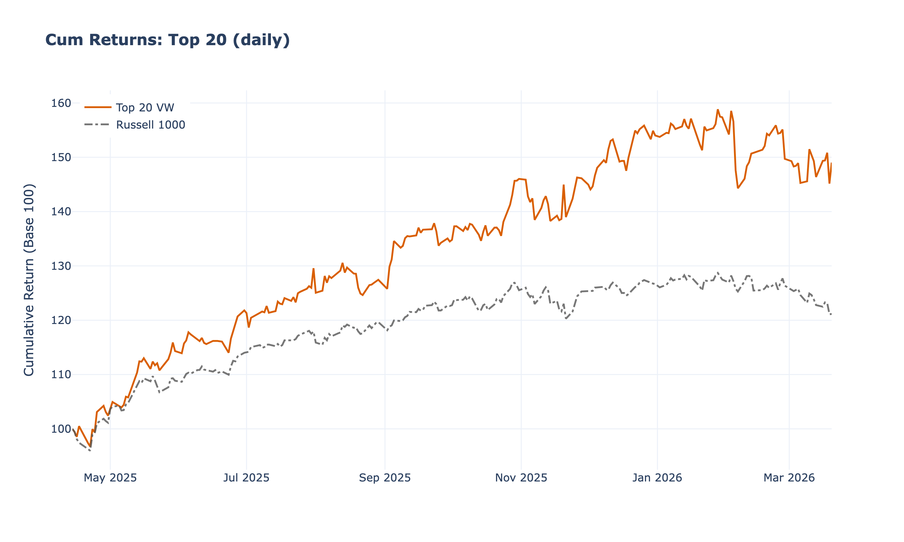

# AI-Stock-Nowcasting
Real-time cross-sectional stock nowcasting project initiated by Zefeng Chen and Darcy Pu at Guanghua School of Management, Peking University

# Autonomous Market Intelligence: Agentic AI Nowcasting Predicts Stock Returns

[](https://github.com/mapledust0/AI-Stock-Nowcasting)
[](https://mapledust0.github.io/AI-Stock-Nowcasting/plot.html)

> **Zefeng Chen & Darcy Pu** > *Guanghua School of Management, Peking University* > January 11, 2026

---

> **Disclaimer:**  
> The information and results presented in this project are for research and educational purposes only. They do not constitute financial advice or investment recommendations. Past performance is not indicative of future results. Please consult a qualified financial advisor before making investment decisions.

---

## 📝 Abstract

Can fully agentic AI nowcast stock returns? We deploy a state-of-the-art Large Language Model to evaluate the attractiveness of each Russell 1000 stock daily, starting from April 2025 when AI web interfaces first enabled real-time search.

Our framework is **100% agentic**: we do not feed the model news or curated text; it autonomously searches the web, filters sources, and synthesizes information into quantitative predictions. We find that AI possesses genuine stock selection ability, particularly for identifying top winners. Longing the 20 highest-ranked stocks generates a daily Fama-French five-factor alpha of **18.4 basis points** and an annualized Sharpe ratio of **2.43**.


---

## ⚙️ Methodology

* **Universe:** Russell 1000 (~93% of US Equity Market Cap).
* **Mechanism:** Agentic Workflow. The AI autonomously generates search queries, browses the live web, and synthesizes data.
* **Constraint:** Strict Nowcasting. All predictions are generated after market close ($t-1$) and before market open ($t$) to eliminate look-ahead bias.
* **Signal:** An attractiveness score ranging from -5 (Strong Sell) to +5 (Strong Buy).

---

## 📊 Interactive Visualization

**[👉 Click here to launch the Interactive Portfolio Simulator](https://mapledust0.github.io/AI-Stock-Nowcasting/plot.html)**

This project hosts the interactive results for the paper *Autonomous Market Intelligence*. The visualization allows users to explore the **Top-N Portfolio Returns** dynamically.

### Features
* **Adjust Portfolio Size (N):** Observe how performance changes as you expand the portfolio from the Top 10 to Top 100 stocks.
* **Benchmark Comparison:** Real-time comparison against the Russell 1000 index.
* **Alpha Decay:** Visualize the "hockey stick" pattern where predictive power is concentrated in the highest-conviction stocks.

---



---

## 🔑 Key Findings

### 1. Superior "Winner-Picking" Ability
The AI model demonstrates a localized information advantage. The **Top 20 Value-Weighted Portfolio** accumulated approximately **50% returns** over the nine-month sample period (April 2025–January 2026), compared to 26% for the benchmark.

### 2. The Asymmetry of AI Prediction
The predictive power is not symmetric. While the AI excels at identifying opportunities (winners), it struggles to reliably distinguish future losers from average stocks. Bottom-ranked stocks exhibit returns statistically indistinguishable from the market.

> *"We hypothesize that this asymmetry reflects online information structure: genuinely positive news generates coherent signals, while negative news is contaminated by strategic corporate obfuscation."*

### 3. Alpha Dilution
The interactive plot demonstrates a critical insight: **predictability is highly concentrated.** Expanding the portfolio beyond the top tier (e.g., moving from Top 20 to Top 100) rapidly dilutes alpha.

---

[](./Artificial_Intelligence_ChenPu.pdf)

---

## 📚 Citation

If you use this project or its results in your own work, please cite:

```bibtex
@article{chen_pu_2026,
  title={Autonomous Market Intelligence: Agentic AI Nowcasting Predicts Stock Returns},
  author={Chen, Zefeng and Pu, Darcy},
  journal={Working paper},
  year={2026},
  month={January}
}

